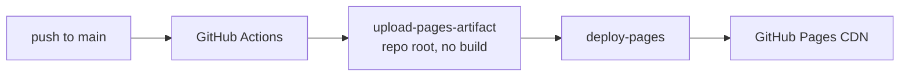

<div align="center">

# JetForce Washing

**A marketing site for a local pressure-washing business — designed, built, and shipped solo.**

No framework, no build step, no dependencies. 1,457 lines of hand-written HTML, CSS and JavaScript,
deployed continuously to GitHub Pages.

[**→ View the live site**](https://ym-mmv.github.io/JetForceWashing-website/)

</div>

> [!NOTE]
> **This is an archived portfolio piece.** JetForce Washing is no longer trading. The site is kept
> online as a demonstration of the work. The phone number on it is one of Ofcom's reserved
> fictional numbers, the quote form is in demo mode and posts nowhere, and the photography is
> Creative Commons stock rather than the business's own jobs. Details in
> [Archive notes](#archive-notes).

---

## Contents

- [What it is](#what-it-is)
- [At a glance](#at-a-glance)
- [Design system](#design-system)
- [Engineering notes](#engineering-notes)
- [Accessibility](#accessibility)
- [Deployment](#deployment)
- [Running it locally](#running-it-locally)
- [Project structure](#project-structure)
- [Archive notes](#archive-notes)
- [Licence](#licence)

---

## What it is

A single-page site for a domestic exterior-cleaning business in West London: driveways, patios,
walls and fencing, plus resanding and sealing.

The brief was the ordinary one for a local trade — look credible, be readable on a phone, and make
it obvious how to get a quote. The interesting constraints were the ones underneath that: it had to
be fast on mobile data, findable in local search, and cheap enough to run indefinitely, which ruled
out anything with a server or a monthly bill.

The result is a static site with **zero runtime dependencies** that costs nothing to host.

## At a glance

| | |
|---|---|
| **Stack** | HTML, CSS, JavaScript. No framework, no bundler, no preprocessor |
| **Dependencies** | None. No `package.json`, no `node_modules`, no lockfile |
| **Build step** | None. The repo root *is* the deployed artifact |
| **Source size** | 526 lines HTML · 747 CSS · 145 JS · 39 (404 page) |
| **Page weight** | ~949 KB over 9 requests — 900 KB of that is photography |
| **Third-party runtime** | One: Google Fonts. No analytics, no trackers, no cookies |
| **Deploy** | GitHub Actions → GitHub Pages on every push to `main` |
| **Contrast** | Every text/background pair verified against WCAG AA |

## Design system

Built around a cyan-teal sampled directly out of the logo artwork (`#379FBF`), on a deep navy base.


Two colours do the heavy lifting, and the split between them is deliberate. `#1596bd` reads better
but only manages **3.43:1** on white — fine for large display text, a WCAG failure for button
labels. So buttons and links use the darker `#0d7a9b` at **4.91:1**, and the brighter tone is
reserved for accents and the hero gradient, where the text is large enough to qualify. Getting this
wrong is the single most common accessibility bug on marketing sites.

## Engineering notes

<details>
<summary><b>Progressive enhancement — the page never depends on JavaScript</b></summary>

<br>

Scroll-reveal animations start at `opacity: 0`, which means a broken or blocked script would leave
a permanently invisible page. The reveal styles are therefore scoped behind a `.js` class that an
inline script in `<head>` adds:

```html
<script>document.documentElement.classList.add('js');</script>
```

```css
.js .reveal { opacity: 0; transform: translateY(18px); }
.js .reveal.is-visible { opacity: 1; transform: none; }
```

No JavaScript, no `.js` class, no hidden content. The hero opts out of reveal entirely so
above-the-fold content paints immediately rather than waiting on `IntersectionObserver`.

</details>

<details>
<summary><b>Reveal animations via IntersectionObserver, with a reduced-motion path</b></summary>

<br>

Sections fade in as they enter the viewport, and each element is unobserved once shown so the
callback stops firing. Users who ask for less motion skip the mechanism entirely rather than
getting a faster version of it:

```js
if (reduced || !('IntersectionObserver' in window)) {
  reveals.forEach(el => el.classList.add('is-visible'));  // just show everything
}
```

</details>

<details>
<summary><b>Responsive images that can't break the layout</b></summary>

<br>

Every photo sits in a fixed `aspect-ratio` box with `object-fit: cover`, so swapping in a
photo of any dimension can never change the page layout — portrait, landscape or square all crop
to the same frame.

This needed `height: auto` in the reset. The `width`/`height` HTML attributes are there to reserve
space and prevent layout shift, but they map to presentational hints that outrank `aspect-ratio`
in the cascade — so without `height: auto`, a 733×1100 portrait rendered at its full intrinsic
height and blew the hero apart.

</details>

<details>
<summary><b>Image budget</b></summary>

<br>

The original photography totalled **6 MB** — around 3.5 MB for a single driveway shot. Resized to a
sensible maximum dimension and recompressed, the same four images come to **~900 KB**, with no
visible quality loss at the sizes they're displayed at. Below-the-fold images are `loading="lazy"`;
the hero is `fetchpriority="high"` since it's the LCP element.

</details>

<details>
<summary><b>Local SEO</b></summary>

<br>

For a business whose customers search "driveway cleaning near me", structured data matters more
than keyword density. The page carries a `HomeAndConstructionBusiness` JSON-LD block with
`areaServed` enumerated across ten West London districts, plus an `OfferCatalog` of the four
services. Alongside that: canonical URL, Open Graph and Twitter card tags, `sitemap.xml`,
`robots.txt`, and an FAQ section written against the questions people actually search.

</details>

<details>
<summary><b>Paths that survive being served from a subpath</b></summary>

<br>

The site is served from `/JetForceWashing-website/`, not a domain root. Root-absolute asset paths
like `/favicon.ico` resolve to `ym-mmv.github.io/favicon.ico` and 404 — which is exactly what
happened on the first deploy.

`index.html` now uses **relative** paths, which work both on the project subpath and at a domain
root if the site ever moves. `404.html` is the exception and uses absolute
`/JetForceWashing-website/…` paths, because GitHub serves it for missing URLs at *any* depth, where
relative paths would resolve against the broken URL instead.

</details>

<details>
<summary><b>Form handling without a backend</b></summary>

<br>

The quote form used Formspree, posted with `fetch` so the visitor never left the page, with inline
status messaging instead of `alert()` popups. Native browser validation runs first and the
JavaScript only takes over once the form is actually valid:

```js
if (!form.checkValidity()) return;   // let the browser show its own UI
e.preventDefault();
```

A hidden honeypot field catches the bots that fill in everything. Failures surface the phone number
rather than a dead end.

</details>

## Accessibility

Not an afterthought, and not assumed — the contrast ratios were computed rather than eyeballed.
Two real failures turned up that way and were fixed:

| Element | Before | After |
|---|---|---|
| Primary button (white on brand) | 3.43:1 ❌ | **4.91:1** ✅ |
| Hero gradient, bright end | 2.33:1 ❌ | **3.43:1** ✅ *(large text)* |
| "After" badge (white on brand) | 3.43:1 ❌ | **5.29:1** ✅ |
| Body copy | — | **6.92:1** ✅ |
| Footer text on navy | — | **8.92:1** ✅ |

Also in place: a skip link, semantic landmarks, visible `:focus-visible` rings, `aria-expanded` and
`aria-label` kept in sync on the mobile menu toggle, `aria-live` status messaging on the form,
keyboard dismissal of the nav, decorative SVGs marked `aria-hidden`, and a full
`prefers-reduced-motion` path.

## Deployment



Originally on the legacy Jekyll builder, which failed repeatedly with no usable error output.
Switching to the Actions workflow gave real logs, which showed the actual cause was a GitHub-wide
Actions and Pages outage rather than anything in the repo. The workflow stayed, because visible
logs beat a silent black box. A `.nojekyll` file stops Pages trying to run Jekyll over a site that
has no Jekyll in it.

## Running it locally

No install step. The page uses `fetch` and relative paths, so serve it rather than opening the file
directly:

```bash
python3 -m http.server 4173
```

Then open <http://localhost:4173>.

## Project structure

```
├── index.html              # The entire site
├── styles.css              # All styling; design tokens as CSS custom properties
├── script.js               # Nav, sticky header, scroll reveals, form
├── 404.html                # Not-found page
├── assets/                 # Logo and photography
├── sitemap.xml robots.txt site.webmanifest
├── .nojekyll               # Serve files as-is; don't run Jekyll
└── .github/workflows/deploy.yml
```

## Archive notes

The business has closed, so a few things were deliberately changed to make the site safe to leave
online as a public demo:

- **Phone number** — replaced with `07700 900123`. Ofcom permanently reserves
  `07700 900000–900999` for use in fiction and never allocates it, so it cannot ring a real person.
- **Quote form** — carries a `data-demo` attribute. It still validates, still shows its loading
  state, and then tells you plainly that nothing was sent. The original Formspree endpoint was
  removed rather than left collecting real enquiries.
- **Email** — removed entirely. The `@jetforcewashing.com` domain is no longer ours, so any address
  on it would be dead or, worse, reaching somebody else.
- **Photography** — Creative Commons stock standing in for the business's own job photos, credited
  in the site footer.
- **Reviews** — genuine comments from past customers, kept as they were.

## Licence

Code is [MIT](LICENSE) — take any of it.

Photography is **not** covered by that licence. Full details in [NOTICE](NOTICE):

| Image | Author | Licence |
|---|---|---|
| `assets/hero.jpg` | Stevie Rocco | [CC BY 2.0](https://creativecommons.org/licenses/by/2.0/) |
| `assets/in-progress.jpg` | Cvcuk | [CC BY-SA 4.0](https://creativecommons.org/licenses/by-sa/4.0/) |

The JetForce Washing name and logo are not covered either.
