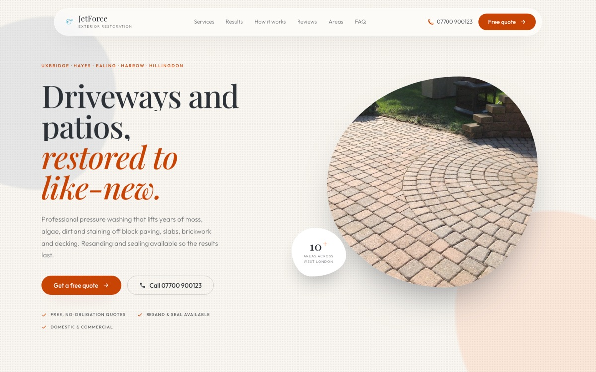
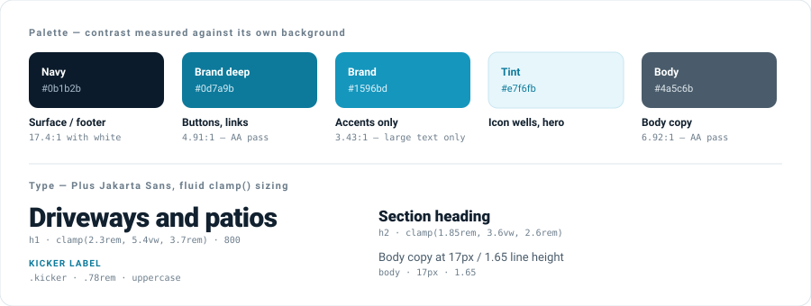
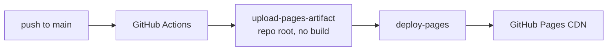

<div align="center">

# JetForce Washing

**A marketing site for a local pressure-washing business — designed, built, and shipped solo.**

No framework, no build step, no dependencies. 1,800 lines of hand-written HTML, CSS and JavaScript,
deployed continuously to GitHub Pages.

[**→ View the live site**](https://ym-mmv.github.io/JetForceWashing-website/)

</div>



> [!NOTE]
> **This is an archived portfolio piece.** JetForce Washing is no longer trading. The site is kept
> online as a demonstration of the work. The phone number on it is one of Ofcom's reserved
> fictional numbers, the quote form is in demo mode and posts nowhere, and the photography is
> Creative Commons stock rather than the business's own jobs. Details in
> [Archive notes](#archive-notes).

---

## Contents

- [What it is](#what-it-is)
- [At a glance](#at-a-glance)
- [Design system](#design-system)
- [Engineering notes](#engineering-notes)
- [Accessibility](#accessibility)
- [Deployment](#deployment)
- [Running it locally](#running-it-locally)
- [Project structure](#project-structure)
- [Archive notes](#archive-notes)
- [Licence](#licence)

---

## What it is

A single-page site for a domestic exterior-cleaning business in West London: driveways, patios,
walls and fencing, plus resanding and sealing.

The brief was the ordinary one for a local trade — look credible, be readable on a phone, and make
it obvious how to get a quote. The interesting constraints were the ones underneath that: it had to
be fast on mobile data, findable in local search, and cheap enough to run indefinitely, which ruled
out anything with a server or a monthly bill.

The result is a static site with **zero runtime dependencies** that costs nothing to host.

The current look came later, from a design canvas mockup — an editorial serif treatment that
replaced an earlier, more conventional blue-gradient version. Porting it meant rebuilding its
Tailwind/GSAP/Lenis toolchain by hand and correcting its colour contrast; both are covered below.

## At a glance

| | |
|---|---|
| **Stack** | HTML, CSS, JavaScript. No framework, no bundler, no preprocessor |
| **Dependencies** | None. No `package.json`, no `node_modules`, no lockfile |
| **Build step** | None. The repo root *is* the deployed artifact |
| **Source size** | 583 lines HTML · 783 CSS · 372 JS · 65 (404 page) |
| **Page weight** | 576 KB over 8 requests on load; 3.3 MB / 11 once the lazy video is reached |
| **Third-party runtime** | One: Google Fonts. No analytics, no trackers, no cookies |
| **Deploy** | GitHub Actions → GitHub Pages on every push to `main` |
| **Contrast** | 119 text elements audited against their real composited backgrounds — 0 failures |

## Design system

Warm sand ground, charcoal text, an editorial serif paired with a geometric sans — a deliberate
move away from the generic blue-gradient look most trade sites land on.



The orange is **split into two roles**, and that split is the whole point. `#ff7a3d` is the colour
the design is built around, but it manages only **2.40:1** as text on sand and **2.59:1** behind a
white button label — both well under the 4.5:1 floor. Rather than abandon it or ship an
inaccessible page, it is restricted to things with no glyphs on them: the blurred hero blobs, the
drawn walkway, section rules, the fine dot texture. Anything carrying text uses `#c74405` instead,
at **4.57:1** on sand and **4.93:1** behind white.

Same reasoning for steel `#c4ccd3`: at 1.51:1 it can tint a section band or fill a pill, and it is
never allowed near a letterform.

## Engineering notes

<details>
<summary><b>Progressive enhancement — the page never depends on JavaScript</b></summary>

<br>

Scroll-reveal animations start at `opacity: 0`, which means a broken or blocked script would leave
a permanently invisible page. The reveal styles are therefore scoped behind a `.js` class that an
inline script in `<head>` adds:

```html
<script>document.documentElement.classList.add('js');</script>
```

```css
.js .l-in    { transform: translateY(115%); }
.js .is-in .l-in { transform: translateY(0); }
.js .fade-up { opacity: 0; transform: translateY(30px); }
```

No JavaScript, no `.js` class, no hidden content — every heading, photo and paragraph renders. The
hero is revealed on a short timer rather than by the observer, so above-the-fold content paints
immediately instead of waiting for a scroll event that may never come.

</details>

<details>
<summary><b>Rebuilding the design's motion without GSAP</b></summary>

<br>

The design was handed over as a canvas mockup running Tailwind's browser runtime plus **GSAP,
ScrollTrigger and Lenis** from CDNs — around 100 KB of libraries and four external requests, for a
site whose entire point is that it has no dependencies. All of it is hand-written here instead.

Most of it is ordinary `IntersectionObserver` work. The two *scrubbed* effects — the polaroids
fanning apart and the walkway drawing itself — need continuous scroll position rather than a
one-shot trigger, so they share a single `requestAnimationFrame` loop. The loop is not always
running: an observer flips each effect active only while its section is near the viewport, and the
loop stops itself when nothing is active.

```js
function step() {
  var anyActive = false;
  for (var i = 0; i < scrubbers.length; i++) {
    var s = scrubbers[i];
    if (!s.active) continue;
    anyActive = true;
    var r = s.el.getBoundingClientRect();
    s.fn(clamp01((vh * s.start - r.top) / (vh * s.start - (-r.height + vh * s.end))));
  }
  ticking = false;
  if (anyActive) kick();      // idle whenever nothing is on screen
}
```

Each effect just maps `0..1` onto CSS custom properties, so the transforms stay in the stylesheet:

```js
pols[i].style.setProperty('--x', x + 'px');
pols[i].style.setProperty('--r', r + 'deg');
```

The fan-out distance is derived from the container width rather than the mockup's fixed ±350px,
which would overflow a phone. Under `prefers-reduced-motion` the polaroids are placed in their
final fanned position once, with no scroll coupling at all.

</details>

<details>
<summary><b>A 2.2 MB video that doesn't cost 2.2 MB</b></summary>

<br>

The closing panel plays a loop of evening light moving across stone. It is self-hosted rather than
hotlinked from the stock provider's CDN — hotlinking makes the page depend on someone else's
uptime and hotlink policy.

It carries no `src` in the markup. An observer swaps `data-src` in only when the panel is within
200px of the viewport, so the initial page load is **576 KB over 8 requests**; the video is only
fetched by visitors who scroll that far. Under `prefers-reduced-motion` the `data-src` is dropped
entirely and the poster frame stays put — the video never loads and never plays.

The caption is white text over moving footage, where no fixed colour pair can be verified. A
gradient scrim under it guarantees **18.9:1** at its darkest regardless of the frame behind.

</details>

<details>
<summary><b>Reveal animations via IntersectionObserver, with a reduced-motion path</b></summary>

<br>

Sections fade in as they enter the viewport, and each element is unobserved once shown so the
callback stops firing. Users who ask for less motion skip the mechanism entirely rather than
getting a faster version of it:

```js
if (reduced || !('IntersectionObserver' in window)) {
  reveals.forEach(el => el.classList.add('is-visible'));  // just show everything
}
```

</details>

<details>
<summary><b>Responsive images that can't break the layout</b></summary>

<br>

Every photo sits in a fixed `aspect-ratio` box with `object-fit: cover`, so swapping in a
photo of any dimension can never change the page layout — portrait, landscape or square all crop
to the same frame.

This needed `height: auto` in the reset. The `width`/`height` HTML attributes are there to reserve
space and prevent layout shift, but they map to presentational hints that outrank `aspect-ratio`
in the cascade — so without `height: auto`, a 733×1100 portrait rendered at its full intrinsic
height and blew the hero apart.

</details>

<details>
<summary><b>Image budget</b></summary>

<br>

The original photography totalled **6 MB** — around 3.5 MB for a single driveway shot. Resized to a
sensible maximum dimension and recompressed, the same four images come to **~830 KB**, with no
visible quality loss at the sizes they're displayed at. Below-the-fold images are `loading="lazy"`;
the hero is `fetchpriority="high"` since it's the LCP element.

The video is the largest single asset at 2.2 MB, which is why it is never part of the initial
load — see the lazy-loading note above.

</details>

<details>
<summary><b>Local SEO</b></summary>

<br>

For a business whose customers search "driveway cleaning near me", structured data matters more
than keyword density. The page carries a `HomeAndConstructionBusiness` JSON-LD block with
`areaServed` enumerated across ten West London districts, plus an `OfferCatalog` of the four
services. Alongside that: canonical URL, Open Graph and Twitter card tags, `sitemap.xml`,
`robots.txt`, and an FAQ section written against the questions people actually search.

</details>

<details>
<summary><b>Paths that survive being served from a subpath</b></summary>

<br>

The site is served from `/JetForceWashing-website/`, not a domain root. Root-absolute asset paths
like `/favicon.ico` resolve to `ym-mmv.github.io/favicon.ico` and 404 — which is exactly what
happened on the first deploy.

`index.html` now uses **relative** paths, which work both on the project subpath and at a domain
root if the site ever moves. `404.html` is the exception and uses absolute
`/JetForceWashing-website/…` paths, because GitHub serves it for missing URLs at *any* depth, where
relative paths would resolve against the broken URL instead.

</details>

<details>
<summary><b>Form handling without a backend</b></summary>

<br>

The quote form used Formspree, posted with `fetch` so the visitor never left the page, with inline
status messaging instead of `alert()` popups. Native browser validation runs first and the
JavaScript only takes over once the form is actually valid:

```js
if (!form.checkValidity()) return;   // let the browser show its own UI
e.preventDefault();
```

A hidden honeypot field catches the bots that fill in everything. Failures surface the phone number
rather than a dead end.

</details>

## Accessibility

Not an afterthought, and not eyeballed. A script walks every text-bearing element, resolves the
**real composited background** by compositing each translucent ancestor in turn, and checks the
ratio against the threshold for that element's own font size and weight.

Run against the design as drawn, it found **11 failures**. The mockup leans on low-opacity muted
text — `/45` through `/65` — which looks refined and is often unreadable:

| Element | As designed | Fixed |
|---|---|---|
| Form field labels | 2.82:1 ❌ | **5.45:1** ✅ |
| Contact detail labels | 2.82:1 ❌ | **5.45:1** ✅ |
| Footer meta line | 3.74:1 ❌ | **5.69:1** ✅ |
| Service card copy | 3.88:1 ❌ | **5.45:1** ✅ |
| Process step copy | 3.88:1 ❌ | **5.45:1** ✅ |
| FAQ answers | 3.99:1 ❌ | **5.39:1** ✅ |
| Results note link | 3.83:1 ❌ | **5.04:1** ✅ |
| Bright orange as text | 2.40:1 ❌ | withdrawn from text entirely |
| White on bright orange | 2.59:1 ❌ | withdrawn from buttons entirely |
| Video caption | unverifiable | **18.9:1** ✅ *(gradient scrim)* |

Each replacement opacity was solved for rather than guessed — the minimum alpha that clears 4.5:1
**on the specific background that element sits on**, since the sand ground, the steel-tinted bands
and the charcoal footer all need different values. The shipped values sit a little above those
minimums, so the figures above are the ratios as measured on the deployed page, not the targets.

Re-audited after the fixes: **0 failures across 119 elements**, tightest passing pair 4.56:1.

Also in place: a skip link, semantic landmarks, visible `:focus-visible` rings, `aria-expanded` and
`aria-label` kept in sync on the mobile menu toggle, `aria-live` status messaging on the form,
`aria-selected` on the review tabs, keyboard dismissal of the nav, decorative SVGs marked
`aria-hidden`, and a full `prefers-reduced-motion` path that switches the scrubbed animations off
rather than merely speeding them up.

The review carousel also stops rotating on hover, on focus, and when the tab is hidden — nothing
slides out from under someone mid-sentence.

## Deployment



Originally on the legacy Jekyll builder, which failed repeatedly with no usable error output.
Switching to the Actions workflow gave real logs, which showed the actual cause was a GitHub-wide
Actions and Pages outage rather than anything in the repo. The workflow stayed, because visible
logs beat a silent black box. A `.nojekyll` file stops Pages trying to run Jekyll over a site that
has no Jekyll in it.

## Running it locally

No install step. The page uses `fetch` and relative paths, so serve it rather than opening the file
directly:

```bash
python3 -m http.server 4173
```

Then open <http://localhost:4173>.

## Project structure

```
├── index.html              # The entire site
├── styles.css              # All styling; design tokens as CSS custom properties
├── script.js               # Nav, reveals, scrubbed animations, carousel, FAQ, form
├── 404.html                # Not-found page
├── assets/
│   ├── hero.jpg before.jpg in-progress.jpg after.jpg
│   ├── stone-light.mp4     # Lazy-loaded closing panel
│   └── stone-light-poster.jpg
├── sitemap.xml robots.txt site.webmanifest
├── .nojekyll               # Serve files as-is; don't run Jekyll
├── NOTICE                  # Media licences and attribution
└── .github/workflows/deploy.yml
```

## Archive notes

The business has closed, so a few things were deliberately changed to make the site safe to leave
online as a public demo:

- **Phone number** — replaced with `07700 900123`. Ofcom permanently reserves
  `07700 900000–900999` for use in fiction and never allocates it, so it cannot ring a real person.
- **Quote form** — carries a `data-demo` attribute. It still validates, still shows its loading
  state, and then tells you plainly that nothing was sent. The original Formspree endpoint was
  removed rather than left collecting real enquiries.
- **Email** — removed entirely. The `@jetforcewashing.com` domain is no longer ours, so any address
  on it would be dead or, worse, reaching somebody else.
- **Photography** — Creative Commons stock standing in for the business's own job photos, credited
  in the site footer.
- **Reviews** — genuine comments from past customers, kept as they were.

## Licence

Code is [MIT](LICENSE) — take any of it.

Photography and video are **not** covered by that licence. Full details in [NOTICE](NOTICE):

| Image | Author | Licence |
|---|---|---|
| `assets/hero.jpg` | Stevie Rocco | [CC BY 2.0](https://creativecommons.org/licenses/by/2.0/) |
| `assets/in-progress.jpg` | Cvcuk | [CC BY-SA 4.0](https://creativecommons.org/licenses/by-sa/4.0/) |
| `assets/stone-light.mp4` | Zeynep Gül Ceylan | [Pexels licence](https://www.pexels.com/license/) |

The JetForce Washing name and logo are not covered either.
